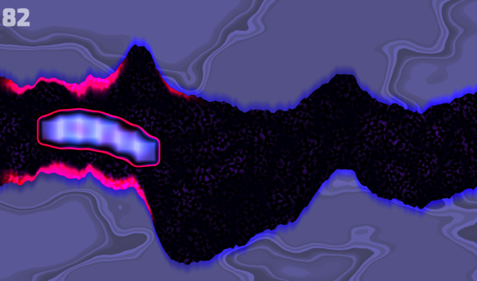

# Under
Under is a minimal game written in JavaScript and GLSL with procedural graphics produced mostly by noise and signed distance functions in a fragment shader. The codebase is small and fairly well-documented, and there are only three dependencies (three.js, Howler, and stats-js).

[Play here!](http://symbolflux.com/under) 

_Controls_: Press up to go up, otherwise you'll go down. Skim the cave edge for more points—but don't run into it!

## Contents
- [Project Background](#project-background)
- [Code Overview](#code-overview)

## Project Background
I recently wrapped up a contract and had some free time on my hands, so I decided to make something 80% for fun. The other 20% was to test out some architecture ideas and to see if I could learn something about my personal bottlenecks in doing side projects. I originally planned to spend only 5 days on it, but that rapidly turned into 9 (full days), and I've been tweaking it and adding sounds when I get a few free moments since. So it's an approximately 10 day project.

The pure fun part was largely that I already knew pretty clearly how to make the game—and in fact, I'd made essentially the [same game](http://symbolflux.com/statichtml/oldprojects/wormgame.html) about 12 years ago—and I knew the technologies involved well, so I could focus almost solely on experimenting with making pretty graphics in GLSL using distance functions and creative ways of combining them (such as you'd run into on e.g. [Shadertoy](https://www.shadertoy.com/)). Additionally, I could enjoy the contrast in what I was able to do with the same project now vs. 12 years go when I was first learning to code :)

The architecture experiment concept is summed up in something I tweeted the other day:

*How about an architecture like a discrete dynamical system driven by events instead of time, where the state evolution and event generation logic changes according to a quasi-FSM where nodes are defined by boolean functions (of system state) instead of explicit graph structure?*

I was reading about about 'simulating the physical world' via Jamie Wong's [excellent article](http://jamie-wong.com/post/simulating-the-physical-world/) and then started thinking about how 'normal' apps are different, and whether they could benefit by sharing some ideas. It seemed to me that Redux for instance must have been inspired by thinking along these lines (no idea if that's true), and that the general notion of 'operation' has a strong resemblance to differentials in a numerical integration process.

The other aspect of the architecture experiment was to attempt a pragmatic balance between functional and OO styles. I did all my high-level planning in terms of pure functions, and felt like I'd got most of the app's essentials down in that fashion—but once I started coding I let go of any strict constraints on functions being pure or data being immutable, hoping that the functional conception of the main structures/algorithms would be sufficient in whatever traces it left.

I had an overall positive experience with the architecture. There are still some kinks to work out, but my plan is to extract a super minimal library/framework from it to use in future projects. I partly want that for doing more games—but I'm also curious how it would extend to domains outside of games.

## Code Overview
coming soon!
