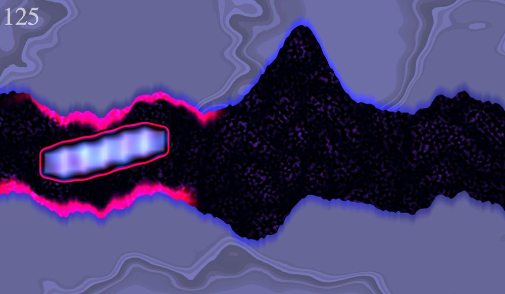

A simple game rendered on a single quad with GLSL. The code tries to strike a pragmatic balance functional and OO styles and use minimal dependencies. It was largely an excuse for me to experiment with creating pretty graphics via a pixel shader, and to experiment with some architecture ideas.

